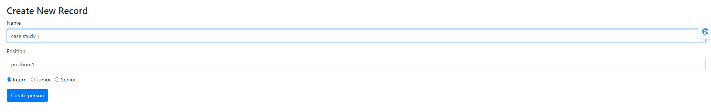
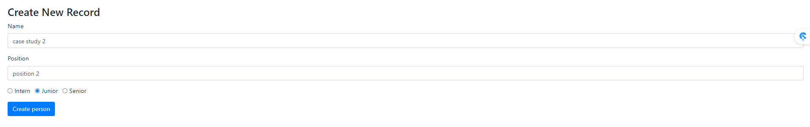
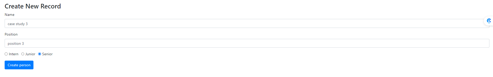
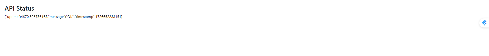
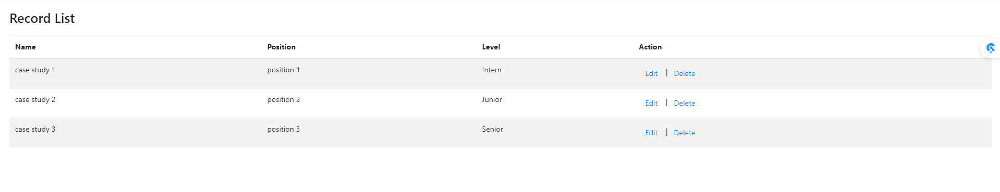
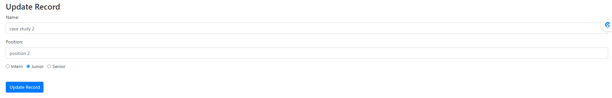
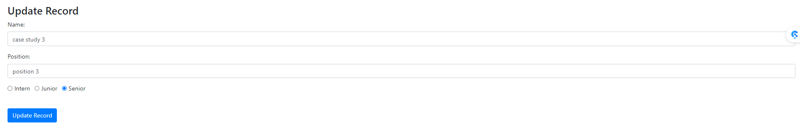
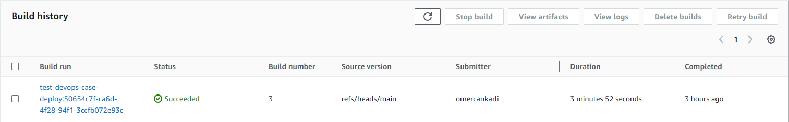
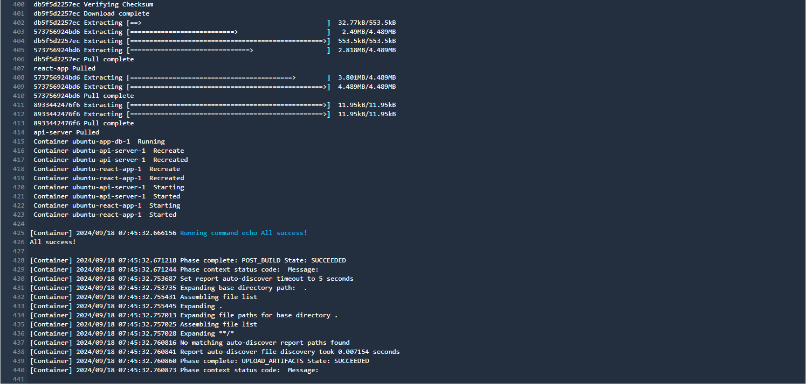
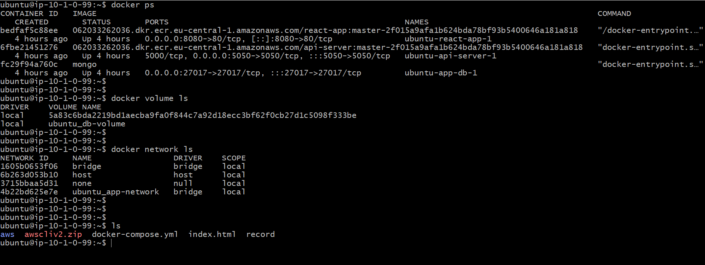

# API Uygulaması Kurulum Rehberi

## Genel Bakış

Bu uygulama, üç farklı microservice üzerinde çalışmaktadır: `client` (react-app), `server` (api-server), ve `db` (mongo). Uygulama, çeşitli kayıtlar eklememize, düzenlememize ve silmemize olanak tanır. Bu işlemler için bir API ile iletişim kurar ve verileri MongoDB veritabanında bir container olarak tutar. Container silindiğinde verilerin kaybolmaması için bu container bir volume ile ilişkilendirilmiştir.

## Projenin Kurulum Basamakları

1. Her bir microservice için Dockerfile hazırlanır (`server` ve `client`).
2. Bu multicontainer uygulamayı kaldırmak için bir docker-compose dosyası hazırlanır.
3. Source kod içerisindeki db bağlantı stringi düzenlenir.
4. CodeBuild servisini kullanarak hazırlayacağımız CI/CD pipeline'ın direktiflerinin yazılı olduğu buildspec dosyası hazırlanır.
5. Terraform scripti ile CodeBuild projesi ve ECR reposu oluşturulur.
6. Deployment için bir EC2 instance açılır ve içerisine docker, docker-compose ve aws cli yüklenir ve credentiallar ile ayarlanır.
7. Sunucuya bağlantı için kullanacağımız private key dosyasını saklamak için bir bucket oluşturulur ve içerisine private key dosyası yüklenir.
8. Source kod ve diğer config dosyaları GitHub reposuna yüklenir.

## Mimari ve Buildspec Dosyasının Çalışma Prensibi

1. Build işlemi için source kod CodeBuild tarafından çekilir.
2. Uygulamayı deploy edeceğimiz uzak sunucuya bağlantı için kullanacağımız private key dosyası S3 bucket'ından çekilir.
3. AWS CLI kullanılarak ECR reposu ile bağlantı kurulur.
4. Her bir microservice için ilgili Dockerfile dosyalarından image build edilir.
5. Bu image dosyaları uygun bir şekilde taglenir ve ECR reposuna gönderilir.
6. Yeni derlediğimiz image dosyalarının isimleri sed komutu kullanılarak docker-compose dosyasına yerleştirilir.
7. scp kullanılarak docker-compose.yml dosyası uzak sunucuya kopyalanır ve ssh komutu ile birlikte bu dosya up edilir ve uygulama stack'imiz uzak sunucuda deploy edilir.

